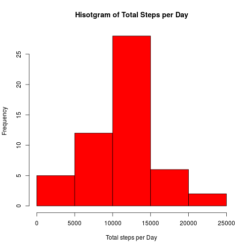
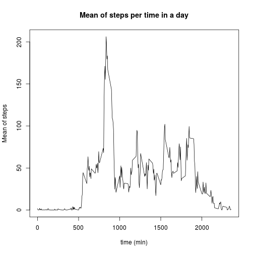

Course Project 1 - Reproducible Research
========================================
Before starting, the following packages must be installed:

```r
library(dplyr)
library(lattice)
```

  
###Loading and preprocessing the data
The following code is used for Data Load and processing.


```r
DataSet<-read.csv("activity.csv")
DataSet$date2<-as.Date(as.character(DataSet$date))
str(DataSet)
```

```
## 'data.frame':	17568 obs. of  4 variables:
##  $ steps   : int  NA NA NA NA NA NA NA NA NA NA ...
##  $ date    : Factor w/ 61 levels "2012-10-01","2012-10-02",..: 1 1 1 1 1 1 1 1 1 1 ...
##  $ interval: int  0 5 10 15 20 25 30 35 40 45 ...
##  $ date2   : Date, format: "2012-10-01" "2012-10-01" ...
```
  

###What is mean total number of steps taken per day?
The following code is used in order to get the mean of steps taken per day. Total number of steps is taken per day. Totals are obtained by using **sapply**, then histogram is obtained.


```r
TotalSteps<-sapply(split(DataSet$steps,DataSet$date),sum)
hist(TotalSteps,xlab="Total steps per Day", main="Hisotgram of Total Steps per Day",col="red")
```




Median and Mean is then provided (respectively):


```r
Median<-median(TotalSteps,na.rm=TRUE)
Mean<-mean(TotalSteps,na.rm=TRUE)
print(Median); print(Mean)
```

```
## [1] 10765
```

```
## [1] 10766.19
```

###What is the average daily activity pattern?
Average activity is calculated using **sapply** with the function *mean*, splitting the data set by interval. A plot can be then provided.

```r
AverageSteps<-with(DataSet, sapply(split(steps,interval),mean,na.rm=TRUE))
plot(x=names(AverageSteps),y=AverageSteps,type="l",xlab="time (min)", ylab="Mean of steps", main="Mean of steps per time in a day")
```



In order to adress the question *Which 5-minute interval, on average across all the days in the dataset, contains the maximum number of steps?* , we can easily see from the plot that the maximum is given in an interval closed to 850. In order to calculate it:

```r
names(which.max(AverageSteps))
```

```
## [1] "835"
```


###Imputing missing values
First, we calculate the number of NAs:

```r
sum(is.na(DataSet$steps))
```

```
## [1] 2304
```

We are going to replace the NA values with the mean of steps in the corresponding period.
First we calculate a vector *added* that contains the values for NA to be replaced. Then convert NAs to 0 in the new DataSet and sum the vector added to the column *steps*.

```r
added<-AverageSteps[as.character(DataSet$interval)]*is.na(DataSet$steps)
DataSetNew<-DataSet
DataSetNew$steps<-sapply(DataSet$steps,function(x){ifelse(is.na(x),0,x)})
DataSetNew$steps<-DataSetNew$steps+added
```

Now we repeat the operations in the first step of this report in order to check the relevance of NAs


```r
TotalStepsNew<-sapply(split(DataSetNew$steps,DataSetNew$date),sum)
hist(TotalStepsNew,xlab="Total steps per Day", main="Hisotgram of Total Steps per Day",col="red")
```


```r
MedianNew<-median(TotalStepsNew)
MeanNew<-mean(TotalStepsNew)
print(MedianNew); print(MeanNew)
```

```
## [1] 10766.19
```

```
## [1] 10766.19
```


###Are there differences in activity patterns between weekdays and weekends?
Now we are going to look for patterns giving the corrected Data Set a new variable that tells us if the measurement was taken during a weekday or a weekend


```r
DataSetNew$day.type<-as.factor(weekdays(as.Date(as.character(DataSetNew$date),"%Y-%m-%d")))
levels(DataSetNew$day.type)<-c("weekend","weekday","weekday","weekday","weekday","weekend","weekday")
str(DataSetNew$day.type)
```

```
##  Factor w/ 2 levels "weekend","weekday": 2 2 2 2 2 2 2 2 2 2 ...
```

Now we plot the result for the different day types:

```r
AverageStepsNew<-with(DataSetNew, aggregate(steps,list(interval,day.type),mean))
names(AverageStepsNew)<-c("time","day.type","steps")
with(AverageStepsNew, xyplot(steps~time|day.type,type="l", layout=c(1,2),xlab="time (min)", ylab="Mean of steps", main="Mean of steps per time in a day"))
```


